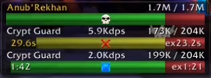

# TimeToKill (TTK)

A World of Warcraft 1.12 addon that estimates time-to-kill for raid bosses and their adds.  
This is not a general TTK addon, it's just for bosses.  

## Features

- **Real-time TTK estimation** - Displays estimated time until boss death based on current DPS
- **Time-to-Execute (TTE)** - Shows time until boss reaches 20% HP (execute phase)
- **Visual indicators**:
  - Green bar: Normal HP
  - Yellow bar: Warning threshold (< 40 seconds TTK)
  - Red bar: Execute range (< 20% HP)
  - Raid target icons displayed on bars
- **Click-to-target** - Click any bar to target that mob (when unlocked)
- **Movable frame** - Drag to reposition (when unlocked)

## Commands

| Command | Description |
|---------|-------------|
| `/ttk` | Show available commands |
| `/ttk lock` | Toggle frame lock (locked = hidden when no targets, unlocked = always visible) |
| `/ttk click` | Toggle click-to-target on bars |
| `/ttk reset` | Reset frame position to center screen |
| `/ttk test` | Toggle test mode (track any enemy, not just bosses) |

> **Note:** Test mode is enabled by default so you can position the frame by fighting any mob. Once you're comfortable with the bar position, use `/ttk test` to disable it and `/ttk lock` to lock the frame. The addon will then only track raid bosses and configured adds.

## Ignored Mobs

Some bosses (like Majordomo Executus) are ignored by default. Edit `TTK_IGNORED_MOBS` table to customize.

## Technical Details

- Uses RLS (Recursive Least Squares) with forgetting factor for DPS estimation
- Forgetting factor allows adaptation to changing DPS rates
- Samples taken every 1 second
- Display values smoothed for stability
- Automatically skips samples during immunity phases or when no damage occurs

___
* Made by and for Weird Vibes of Turtle Wow  